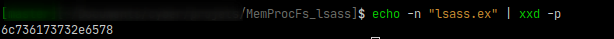
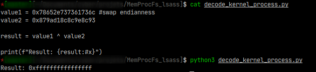

# MemProcFS with lsass minidump

MemProcFS est un outil qui permet de visualiser la mémoire physique sous forme de fichiers dans un file system virtuel. (https://github.com/ufrisk/MemProcFS)

Il embarque avec lui un répertoire `minidump` qui contient un fichier `minidump.dmp` compatible avec WinDbg qui peut être utilisé pour du débogage.
Les fichiers `minidump.dmp` ne sont générés que si certaines conditions préalables sont remplies, dont :

    - Le processus doit être un processus actif en mode utilisateur. Les processus spéciaux tels que System, Registry, LSASS et MemCompression ne génèrent pas de fichiers minidump.

Il peut être pourtant intéressant de récupérer le minidump de `lsass.exe` qui est compatible avec pypykatz.

Juste un petit repo d'une version de memprocfs qui fait un minidump de lsass

---

## Minidump de lsass (MemProcFS version < 5.13.4) 

Lorsqu'on lance l'outil on voit qu'il génère le fichier `Security.txt` dans le dossier minidump de lsass

Le contenu de ce fichier est déclaré dans `vmm -> modules -> m_proc_minidump.c` qui est l'implémentation du module de minidump:

```C
LPCSTR szMMINIDUMP_SECURITY =
"Security information relating to the mindump module                          \n" \
"===================================================                          \n" \
"MemProcFS does not generate a minidump file for LSASS.EXE due to potential security concerns.\n";
```

Le fichier est généré lorsque l'objet du processus possède fDisabledSecurity à `TRUE` :

```C
if(pObMiniDump->fDisabledSecurity) {
    VMMDLL_VfsList_AddFile(pFileList, "security.txt", strlen(szMMINIDUMP_SECURITY), NULL);
} else ...
```

Et `fDisabledSecurity` est set à `TRUE` ici qu'il suffit de supprimer pour récupérer le mindump de lsass:

```C
// ensure the generated file is ok security wise:
if(!strcmp(pProcess->szName, "lsass.exe")) {
    ctx->fDisabledSecurity = TRUE;
}
```

## Minidump de lsass (MemProcFS version >= 5.13.4)

Depuis les derniers commit de MemProcFS (version 5.13.4 à ce jour), même en supprimant la vérification sur `lsass.exe` aucun minidump de lsass est créé.

Des modifications ont été ajoutés dans plusieurs fichiers dont `vmmwin.c` qui est le module lié au système d'exploitation et aux processus. Il parse la mémoire virtuelle notamment pour énumérer les processus présents. 

Il exécute la fonction `VmmProcessCreateEntry()` qui créer un objet processus :

```
pObProcess = VmmProcessCreateEntry(
            H,
            ctx->fTotalRefresh,
            *pdwPID,
            *pdwPPID,
            *pdwState,
            *ppaDTB_Kernel & ~0xfff,
            po->DTB_User ? (*ppaDTB_User & ~0xfff) : 0,
            szName,
            fUser,
            ...
```

La fonction est déclarée comme suit et elle regarde, à l'aide de `_In_ BOOL fUserOnly`, si le process est bien en usermode :

```C
PVMM_PROCESS VmmProcessCreateEntry(_In_ VMM_HANDLE H, _In_ BOOL fTotalRefresh, _In_ DWORD dwPID, _In_ DWORD dwPPID, _In_ DWORD dwState, _In_ QWORD paDTB_Kernel, _In_ QWORD paDTB_UserOpt, _In_ CHAR szName[16], _In_ BOOL fUserOnly, _In_reads_opt_(cbEPROCESS) PBYTE pbEPROCESS, _In_ DWORD cbEPROCESS)
```

Dans le fichier `vmmwin.c` le paramètre `fUserOnly` est défini par `fUser` qui vérifie notamment si le processus possède le PID 4 (System pour Windows), s'il est == `0x78652e7373727363` correspond à `csrss.ex` et il vérifie si le processus xoré par la valeur `0x879ad18c8c9e8c93` et en ajoutant 1 est égal à 0 :

```C
// treat csrss.exe as 'kernel' due to win32k mapping missing in System Process _AND_ treat MemCompression as 'user'
fUser = !((*pdwPID == 4) || ((*pdwState == 0) && (*pdwPEB == 0)) || (*(PQWORD)szName == 0x78652e7373727363) || !((0x879ad18c8c9e8c93 ^ *(PQWORD)szName) + 1)) ||    // csrss.exe
        ((*(PQWORD)(szName + 0x00) == 0x72706d6f436d654d) && (*(PDWORD)(szName + 0x08) == 0x69737365));
```

Par intuition on essaye  `"lsass.ex" ^ 0x879ad18c8c9e8c93` :




and

`0x0FFFFFFFFFFFFFFF + 1 = 0x0000000000000000`

En supprimant cette vérification obfusquée on peut faire un minidump de `lsass.exe`

## Build

### Windows

Pour build le projet sous windows il suffit de git clone le projet original et de le patcher vous même, ou de cloner ce projet-ci (correspond à MemProcFS version 5.13.4). Il faut ensuite ouvrir `MemProcFS.sln` dans Visual Studio et de lancer la compilation.

Il faut ensuite télécharger LeechCore : https://github.com/ufrisk/LeechCore/releases et d'ajouter tous les fichiers dans le dossier `files` sans remplacer les fichiers déjà existant.

### Linux

https://github.com/ufrisk/MemProcFS/wiki/Dev_Building

### Releases

Vous pouvez sinon télécharger une version compilée dans Realeases de ce projet.
